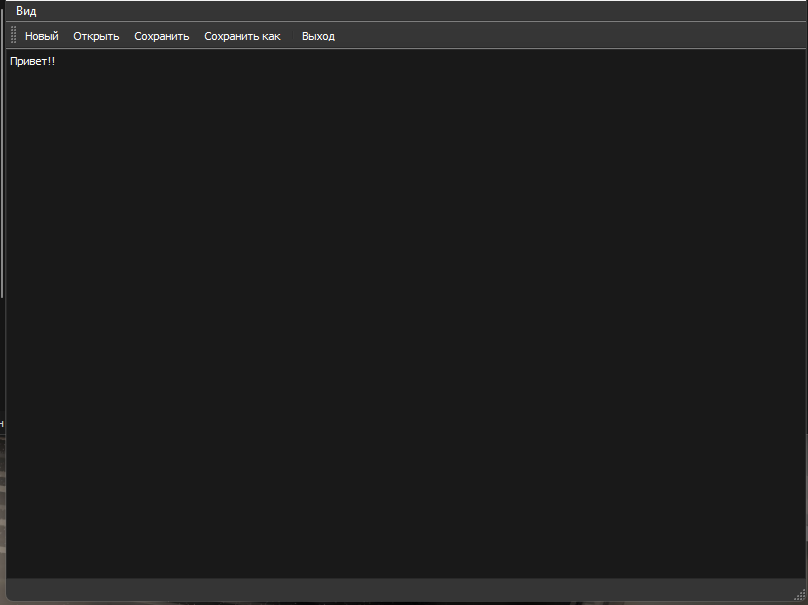

# Notepad Application

## Описание

Это простое приложение блокнота, разработанное на Python с использованием PyQt5. Приложение позволяет пользователю создавать, открывать, сохранять и редактировать текстовые файлы. Он также поддерживает темы оформления для выбора пользователем.

## Функционал

- Создание нового файла
- Открытие существующего файла
- Сохранение файла
- Сохранение файла с новым именем
- Выбор темы оформления (светлая, темная, синяя)
- Изменение размера текста с помощью колесика мыши
- Поиск ключевого слова в файле
- Возможность создания новых заметок (нод)
- Редактирование и группировка заметок
- Связывание заметок друг с другом
- Перемещение по рабочей области с помощью мыши

## Description

This is a simple notepad application developed in Python using PyQt5. The application allows the user to create, open, save, and edit text files. It also supports different themes for user customization.

## Functionality

- Create a new file
- Open an existing file
- Save a file
- Save a file with a new name
- Choose a theme (light, dark, blue)
- Change the text size using the mouse wheel
- Search for a keyword in the file
- Ability to create new notes (nodes)
- Edit and group notes
- Link notes together
- Navigate within the workspace using the mouse

